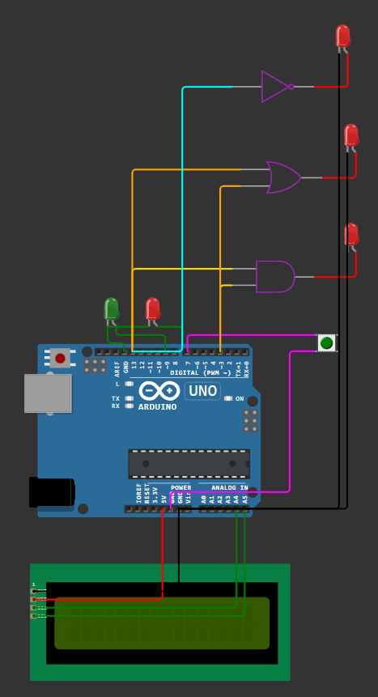

# BitComboGen 🔢

**BitComboGen** is a **2-bit Truth Table Generator** built using **Arduino UNO / MEGA**, 
a **16x2 LCD display (I2C)**, **two LEDs**, and a **push button**.  
It cycles through all **2-bit binary combinations** (`00`, `01`, `10`, `11`) 
and displays them on the **LCD** and **LEDs**.  

---

## 🔹 Features
- Cycles through all 2-bit combinations using a push button.
- Displays current combination on **16x2 LCD**.
- Lights up **two LEDs (A and B)** based on binary output.
- Outputs also available on **extra digital pins (13 for A, 3 for B)**.
- Useful for verifying logic gate truth tables.

---

## 🔌 Components Required
- Arduino UNO / Arduino MEGA  
- 16x2 LCD with I2C module  
- 2 × LEDs (with 220Ω resistors)  
- 1 × Push Button  
- Jumper wires + Breadboard  

---

## ⚡ Circuit Connections

### LCD (16x2 with I2C)
- VCC → 5V  
- GND → GND  
- SDA → A4  
- SCL → A5  

### LEDs
- LED A → Pin 8  
- LED B → Pin 9  

### Extra Outputs
- Output A → Pin 13  
- Output B → Pin 3  

### Push Button
- One side → Pin 7  
- Other side → GND  
- Internal pull-up enabled in code  

---

## 📋 Truth Table

| State | A | B |
|-------|---|---|
| 0     | 0 | 0 |
| 1     | 0 | 1 |
| 2     | 1 | 0 |
| 3     | 1 | 1 |

---

## 🖥️ Arduino Code

See the full code here: [TruthTableGenerator.ino](TruthTableGenerator.ino)

---

## 🚀 Usage
1. Upload the code to Arduino UNO / MEGA.  
2. Connect circuit as per the diagram.  
3. Press the push button to cycle through combinations.  
4. Check outputs on LEDs, extra pins, and LCD.  

---

## 📸 Circuit Diagram

---
---
## 🔧 Components

Arduino UNO

16x2 or 12c LCD display 

Push button (for cycling inputs)

2 LEDs 

Jumper wires and breadboard(optional)

---
## 📜 License
This project is licensed under the **MIT License** – feel free to use and modify.  
